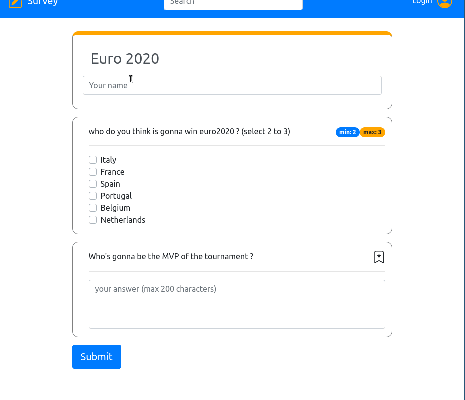

# Exam #1: "Survey"
## Student: s287646 Pronesti Massimiliano 

## React Client Application Routes

I tried to replicate the behavior of common websites where the very same route displays different things when you are logged vs when you're not.

- Route `/surveys`: shows the available surveys or the admin's surveys if logged in

- Route `/survey/:id`: shows a survey of given id or the the replies slideshow if logged in.

- Route `/add`: shows the form to create a survey

## API Server

- POST `/api/sessions`
  * Request body: credentials of the user 
  ```json
  {
    "username": "johndoe@polito.it",
    "password": "password"
  }
  ```
  * Response: `200 OK` (success)
  * Response body: authenticated user(Content-Type: `application/json`)
  ```json
  {
    "id": 1,
    "name": "John",
    "email": "john.doe@polito.it",
    "hashpasswd": "$2b$10$nHLAdGNSlomYH61JO6clH.kZeY7LPlNeuDY1yThhzoEipjJI3YYdW"  
  }
  ``` 
  
- GET `/api/sessions/current`
  * Request body: None
  * Response body: user info (Content-Type: `application/json`)
  ```json
  {
    "id": 1,
    "name": "John",
    "email": "john.doe@polito.it",
    "hashpasswd": "$2b$10$nHLAdGNSlomYH61JO6clH.kZeY7LPlNeuDY1yThhzoEipjJI3YYdW"
  }
  ```
  * Error responses: `500 Internal Server Error`, `401 Unauthorized User` 

- DELETE `/api/sessions/current`
  * Request body: None
  * Response body: None
  * Response: `200 OK` (success)
  * Error responses: `500 Internal Server Error`, `401 Unauthorized User` 

- GET `/api/surveys`
  * Request body: None
  * Response body: Array of objects, each of them representing a survey
  ```json
  [{
    "id": 1,
    "title": "Does modern art worth it?",
    "answers": 15,
    "creator": 1
  }]
  ```
  * Response: `200 OK` (success)
  * Error responses: `500 Internal Server Error`

- POST `/api/surveys`
  * Request body: object representing a survey 
  ```json
  {
    "id": 8,
    "title": "foo",
    "answers": 0,
    "creator": 1
  }
  ```
  * Response: `250` (success) 
  * Response body: the object as represented in the database
  * Error responses: `550 Internal Server Error`, `422 Unprocessable Entity`, `401 Unauthorized User`  
  
- GET `/api/questions`
  * Request body: None
  * Request query parameter: surveyid
  * Response body: Array of objects, each of them representing a question
  ```json
  [{
    "id": "1",
    "content": "What is 3 time 11",
    "survey": 1,
    "min": 0,
    "max": 1,
    "options": "[{\"text\":\"88\",\"id\":128},{\"text\":\"33\",\"id\":1},{\"text\":\"23\",\"id\":2}]"
  }]
  ```
  * Response: `200 OK` (success)

- POST `/api/questions`
  * Request body: object representing a question 
  * Response: `250` (success) 
  * Response body: the object as represented in the database
  * Error responses: `550 Internal Server Error`, `401 Unauthorized User`
- GET `/api/replies`
  * Request body: None
  * Request query parameter: surveyid
  * Response body: Array of objects, each of them representing a reply
  * Response: `200 OK` (success)
  * Error responses: `500 Internal Server Error`, `401 Unauthorized User`

- POST `/api/replies`
  * Request body: object representing a question 
  * Response: `250` (success) 
  * Response body: the object as represented in the database
  * Error responses: `550 Internal Server Error`, `422 Unprocessable Entity`

## Database Tables

- Table `admins` 
  * id 
  * email
  * name
  * hash

- Table `surveys` 
  * id
  * title
  * answers (number of people who filled the survey)
  * admin [foreign key]

- Table `questions` 
  * id
  * content 
  * options (NULL if open ended) 
  * min  (0 to 10)
  * max  (1 to 10)
  * survey [foreign key]

- Table `replies` 
  * id
  * name (the name of the answerer)
  * answers (the list of replies) 
  * survey [foreign key]

- Trigger `trig_reply_ins`: auto update of answers count for each survey
## Main React Components


- `SurveyForm` (in `SurveyForm.js`): allows the user to answer a survey. Detects mandatory unanswered questions marking their borders. Records the reply in the db. It's composed of `MCQuestion`s and `OpenEndedQuestion`s . 

- `AddSurveyForm` (in `AddSurveyForm.js`): allows the administrator to create a new survey, adding and deleting questions, choosing between open-ended and multiple choice questions and defining options for them (10 at most).
Only stores the survey and the questions in the db when the creation process is *successfully* completed.  

- `AnswersSlideShow` (in `AnswersSlideShow.js`) : allows the admin to display received answers to his survyes. It's made of `SurveyForm`s displayed in readonly-mode in a React `Carousel`.

- `SurveyList` (in `SurveyList.js`): represents the list of `SurveyRow`s displayed in the main page of both administrator and unauthenticated user.

- `SurveyRow` (in `SurveyRow.js`) : represents the survey entry in the main page of both administrator and unauthenticated user. Redirects to the reply form or the answers slideshow when the displayed button is pressed. 

- `LoginForm` (in `LoginForm.js`): allows the admin to login to his account. 


## Screenshot


## Extra: Demo
### Create Survey
<p align="center">
  
</p>

### Reply Survey
<p align="center">
  
</p>

### Show Results
<p align="center">
  
</p>

## Users Credentials

| Username                | Passoword | Surveys             |
|-------------------------|-----------|---------............|
| john.doe@polito.it      | password  |  Euro2020, Modern Cinema, Is AI taking over   |
| tony.stark@starkcorp.us | password  |  Animated Movies           |
